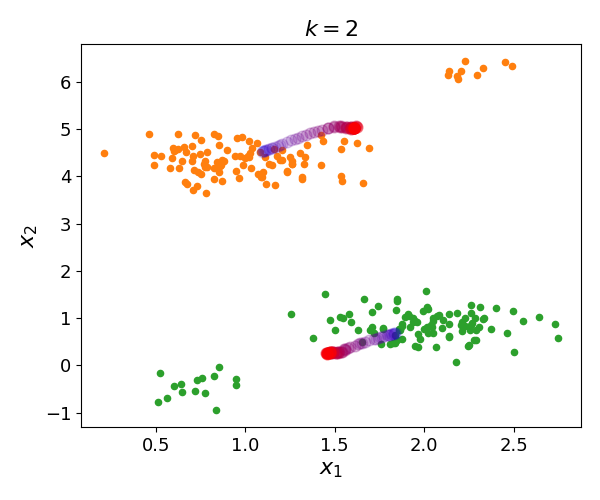
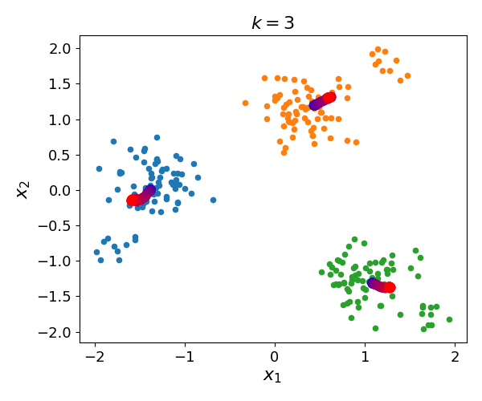

# TKM-master
Python code for paper "Highly-Efficient Large-Scale k-means with Individual Fairness"
## Introduction

This repo holds the source code and scripts for reproducing the key experiments of our paper.

## Datasets

Download the following datasets, and run our `data_process.py`, you can get the data format that can be used in our codes. 

|Datasets|  Description  | Source |
|-------- |------- |-------- |
|Iris |    Including 150 data points and 4 features, we select 4 features: SepalLengthCm, SepalWidthCm, PetalLengthCm, PetalWidthCm.          |       [https://archive.ics.uci.edu/](https://archive.ics.uci.edu/)  |
|Abalone    | Including 4,177 data points and 8 features, we select 8 features: Length, Diameter, Height, Whole weight, Shucked weight, Viscera weight, Shell weight, Rings.  |  [https://archive.ics.uci.edu/](https://archive.ics.uci.edu/) |
|MNIST  |  Including 60,000 data points and 784 dimensions, we select all dimensions.                |   [http://yann.lecun.com/exdb/mnist/](http://yann.lecun.com/exdb/mnist/)|
|Seeds |  Including 210 data points and 8 features, we select 7 features: Area,	Perimeter, Compactness,	Kernel.Length, Kernel.Width, Asymmetry.Coeff,	Kernel.Groove.|[https://archive.ics.uci.edu/](https://archive.ics.uci.edu/)|
|3D-spatial| Including 434,874 data points and 4 features, we select 3 numerical features: longitude, latitude, altitude.   |https://archive.ics.uci.edu/ml/datasets/Parkinsons+Telemonitoring/|
|CNAD | Including 16,829 data points and 12 features, we select 2 features: Latitude, Longitude.          |https://archive.ics.uci.edu/ml/datasets/Parkinsons+Telemonitoring/|
|Health |Including 3,756 data points and 8 features, we select 2 features: Latitude, Longitude.      |https://analyse.kmi.open.ac.uk/open_dataset|
|Mobile|Including 38,529 data points and 31 features, we select 2 features: X,Y.    |https://archive.ics.uci.edu/dataset/246/3d+road+network+north+jutland+denmark    |
|Singapore|Including 25,293 data points and 9 features, we select 2 features: latitude, longtitude.|https://archive.ics.uci.edu/dataset/246/3d+road+network+north+jutland+denmark    |
|Census1990|Including 2,458,285  data points and 69 features, we select 11 numerical features: dAncstry1, dAncstry2, iAvail, iCitizen, iClass, dDepart, iDisabl1, iDisabl2, iEnglish, iFeb55, iFertil. | https://proceedings.neurips.cc/paper/2019/file/fc192b0c0d270dbf41870a63a8c76c2f-Paper|
|HMDA |Including 5,986,660 data points and 53 features, we select 8 numerical features: agency_code, loan_type, loan_purpose, loan_amount_000s, preapproval, state_code, county_code, applicant_ethnicity. | https://ffiec.cfpb.gov/data-browser/|
|Argoverse |Including more than 12,000,000 data points and 2 features: Latitude and Longitude. | https://openaccess.thecvf.com/content_CVPR_2019/papers/Chang_Argoverse_3D_Tracking_and_Forecasting_With_Rich_Maps_CVPR_2019_paper.pdf |

## Start

### Visualization

Run `plot_toy_k=2` and `plot_toy_k=3` directly, then you can get the visualization figures in our experiment.

### Comparison among Various Methods and Parameters

After downloading and processing the raw dataset, then directly run `main.py`, then you get the results of TKM.

Run `Comparison_main` in individually-fair-k-clustering-main, which we forked from https://github.com/moonin12/individually-fair-k-clustering, and you get the results of our comparison methods.

Then, running the codes in plot_figures, you get all of the figures in our experiments.
